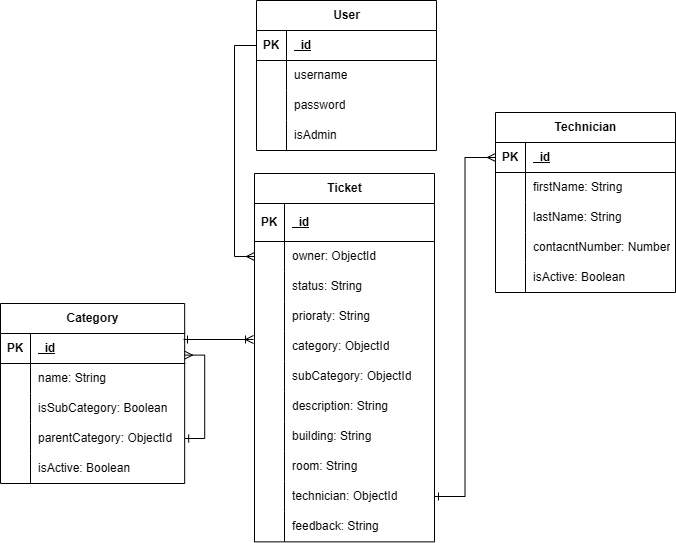

# Project Name
CRMS

## Overview

## Screenshots

## Technologies Used
- HTML
- CSS
- JS
- GitHub

## Getting Started

## Installation

## User Stories
### Guest (Not Logged In User)
- As a guest, I want to access the home page so that I can learn about the system.
- As a guest, I want to view the About Us page so that I can understand the organization's services.

### Admin
- As an admin, I want to log in securely so that I can manage the system.
- As an admin, I want to view the dashboard so that I can monitor overall system activity.
- As an admin, I want to view ticket analytics so that I can identify trends and performance.
- As an admin, I want to view all submitted tickets so that I can manage support requests.
- As an admin, I want to assign a technician to a ticket so that issues are handled by the appropriate staff.
- As an admin, I want to assign a priority level to each ticket so that urgent issues are addressed first.
- As an admin, I want to update the status of tickets so that users are informed of their progress.
- As an admin, I want to reject invalid or duplicate tickets so that only legitimate requests are processed.
- As an admin, I want to create, edit, and delete FAQ entries so that users have access to accurate information.
- As an admin, I want to log out securely so that my account remains protected

### User 
- As a user, I want to log in securely so that I can access my account.
- As a user, I want to view my dashboard so that I can quickly access my support requests.
- As a user, I want to submit a new ticket so that I can report an issue.
- As a user, I want to view all of my submitted tickets so that I can track their progress.
- As a user, I want to edit my ticket before it is resolved so that I can correct any mistakes.
- As a user, I want to delete a ticket that is no longer needed so that my ticket list stays organized.
- As a user, I want to see the status of my tickets so that I know whether they are pending, assigned, or completed.
- As a user, I want to read the FAQ section so that I can solve common problems without submitting a ticket.
- As a user, I want to provide feedback after my ticket is resolved so that I can evaluate the support service.
- As a user, I want to log out securely so that no one else can access my account.

## Database Design

## Routes
### Index 
---
| Method | Route | Description |
|---------|-------|-------------|
| GET | /home | Display Home Page|
| GET | /about | Display About Page |

### Auth
---
| Method | Route | Description |
|---------|-------|-------------|
| GET | auth/sign-up | Sign Up Page |
| POST | auth/sign-up | Create User Account |
| GET | auth/login | Login Page |
| POST | auth/login | Login User into System |
| GET | auth/sign-out | Signout User From System |

### FAQ
---
| Method | Route | Description |
|---------|-------|-------------|
| GET | /faq | FAQ Page |
| GET | /faq/new | New FAQ Page |
| POST | /faq | Create New FAQ |
| GET | /faq/:id/edit | Edit FAQ Page |
| PUT | /faq/:id | Edit FAQ |
| DELETE | /faq/:id/delete | Delete FAQ |

### Category
---
| Method | Route | Description |
|---------|-------|-------------|
| GET | /categories | All Categories Page |
| POST | /categories | Create New Category |
| GET | /categories/:id | Show Category Details |
| POST | /categories/:id | Create Sub-Category |
| PUT | /categories/:id/edit | Update Category |
| PUT | /categories/:id/editsub | Upadte Sub-Category|

### Status
---
| Method | Route | Description |
|---------|-------|-------------|
| GET | /forbidden | Show Forbidden Page |

### Technician
---
| Method | Route | Description |
|---------|-------|-------------|
| GET | /technician | Show All Technicians Page |
| POST | /technician | Add New Technicians |
| PUT | /technician/:id | Edit Technician Details |

### Tickets
---
| Method | Route | Description |
|---------|-------|-------------|

### Analysis
---
| Method | Route | Description |
|---------|-------|-------------|

## Features

## Future Enhancements

## Credits